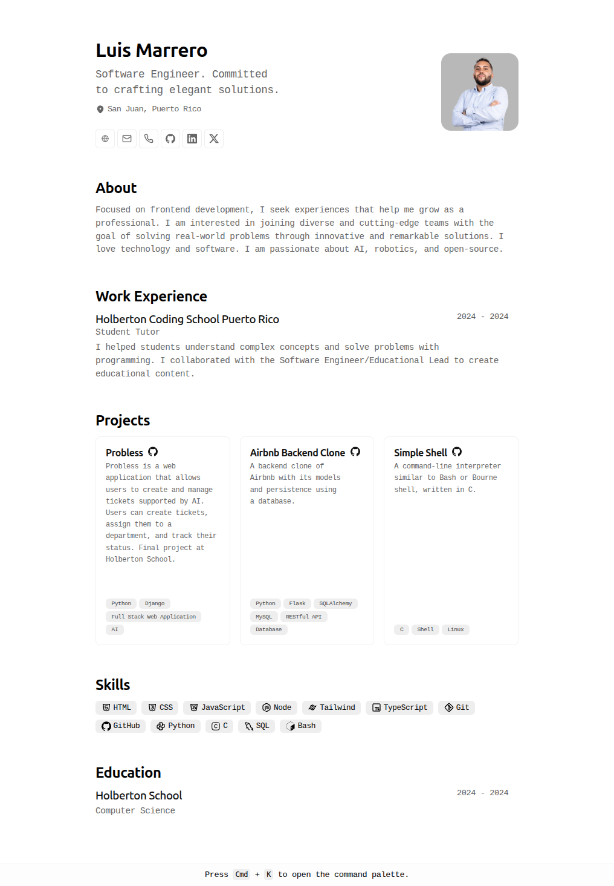

# Portfolio

This is my personal portfolio, where I share my experience, skills, and the most relevant projects I have worked on to date.

Original design by [Bartosz Jarocki](https://github.com/BartoszJarocki/cv).

I based my work on the project by [midudev](https://github.com/midudev/minimalist-portfolio-json/) in the following video: [How to Create a Minimalist Web Portfolio with Astro 4, HTML, CSS](https://www.youtube.com/watch?v=Zwh92LTB-Bk), who adapted the original code to [Astro](https://astro.build/).

The content is generated from a JSON file, based on the [JSON Resume](https://jsonresume.org/schema) schema.

---

 <!-- Centering elements is not possible with pure Markdown -->

[Portfolio](https://cv.luismarrero.me/en/) - [JSON](cv-en.json) - [License](LICENSE)

## 🛠️ Stack

- [Astro](https://astro.build/) - A modern framework for building websites.
- [TypeScript](https://www.typescriptlang.org/) - A superset of JavaScript that adds static typing and class-based objects.
- Native command palette (`Cmd/Ctrl + K`) - a dependency-free dialog/combobox built with HTML, CSS, and TypeScript.

## Print and PDF quality

The print layout is a deliberate two-page resume rather than a copy of the web UI:

- Page 1 contains the print-specific header, profile, work experience, and the first project rows.
- Projects flow into the available space instead of forcing a page break; the remaining row, education, and skills close page 2.
- The six project cards share exactly the same height in the printed grid.
- Skills print as a single comma-separated typographic list instead of pills.
- Contact and project links remain clickable in exported PDFs, with the `•` separators outside the underlined links.
- Letter is the canonical paper size; A4 is also covered as a compatibility check.

Run `pnpm test:print` to build the site and validate both locales in Letter and A4. The tests check page count and size, editorial section order, intact entries, non-orphaned headings, equal project-card heights, the skills list, PDF links, dark-theme reset, contrast, readable type, margins, clipping, and overlaps. Run `pnpm test:ui` for the responsive contracts (hero label separator, education header). Run `pnpm check` for the complete i18n, build, print, and responsive gate.

Node 22.13 or newer is required. After a fresh install, download the test browser once with `pnpm exec playwright install chromium`.

## Notes for Portfolio

- Work Experience organization titles must have a maximum of 3 meaningful words, excluding short articles or prepositions such as `of`. Prefer established abbreviations such as `SAC` when needed.
- Project titles must have a maximum of 2 words.
- Both files (`cv-en.json` and `cv-es.json`) must contain the same content.
- Projects must be sorted by importance (descending order).
- The portfolio must contain exactly 6 projects, active or inactive.
- A stronger new project must replace an existing project; never display more or fewer than 6.
- Project descriptions must not exceed 90 characters (one sentence).
- Projects must not have more than 3 highlights.

## 🔑 License

[MIT](LICENSE)
